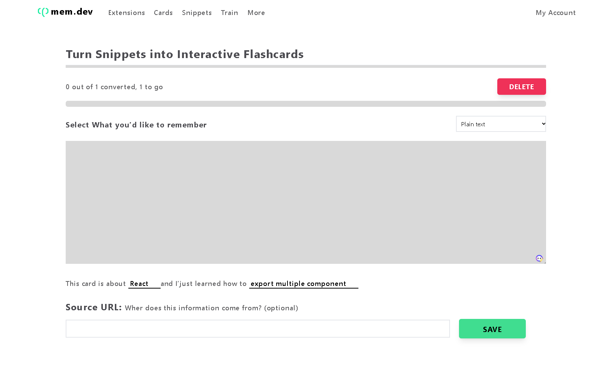

# Welcome! 👋 ( Mem.dev )

 

# Technologies used 
<!-- react logo -->
 <!-- vite logo --> <!-- tailwindcss logo -->
 
 

# My Learning 

  ### Continued development

    ### functioning 
      create snippet 
      Turn into flash card
      Asking 
      feedback ( how much they want to repeat / default )
      
    ### Auth
      create user

  ## Acknowledgments
    

# My Progress 
    ### UI ✅
      navBar
      Hero
      footer

# Feedback for me 

# Useful Resources 

# Course 

## For Developers
    ## The challenge
    ## Clone Repo 
    ## Assets 
    ## Figma file 
    ## Share your project with me 
    ## Need Help from me 

**Have fun  Coding 🚀**